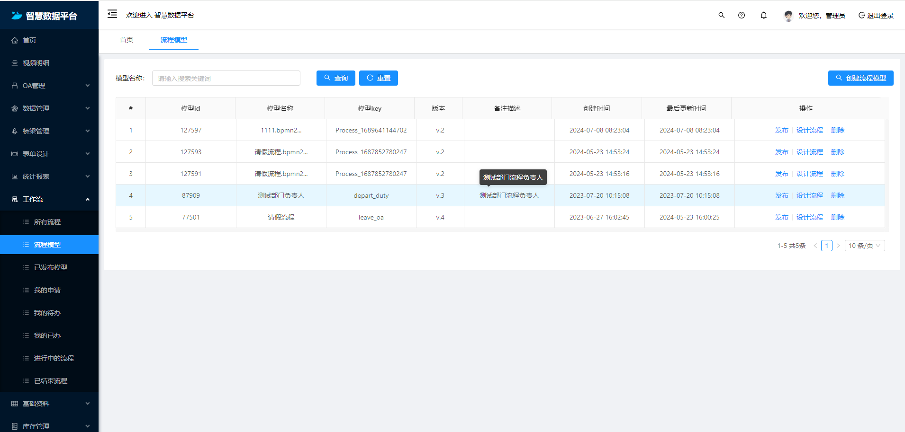
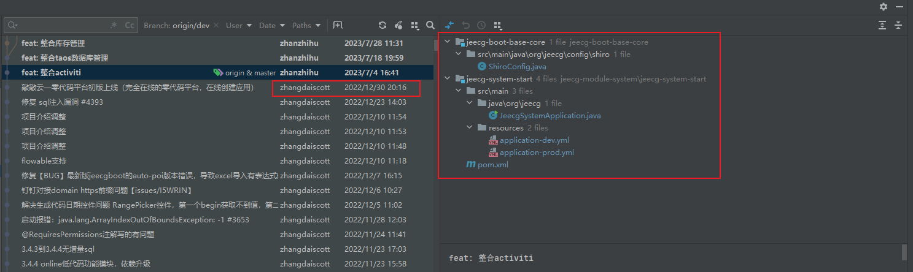
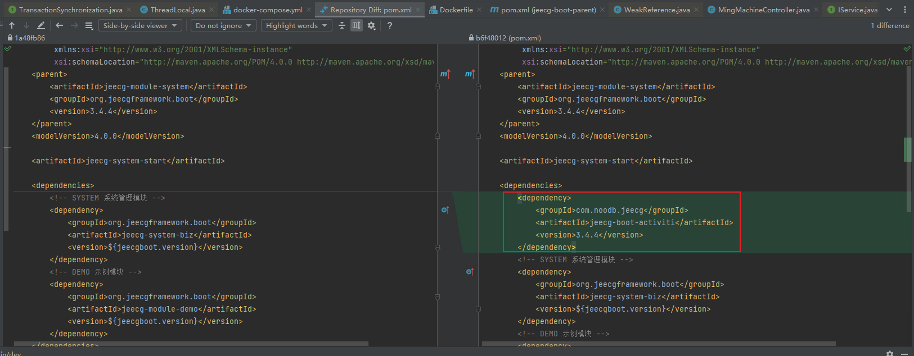
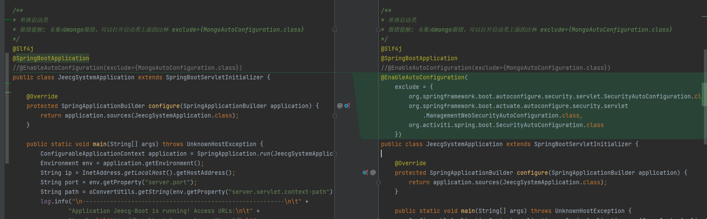
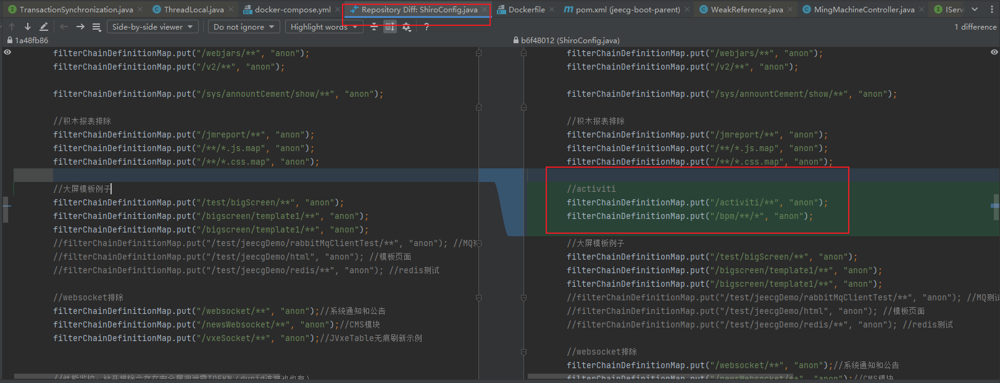
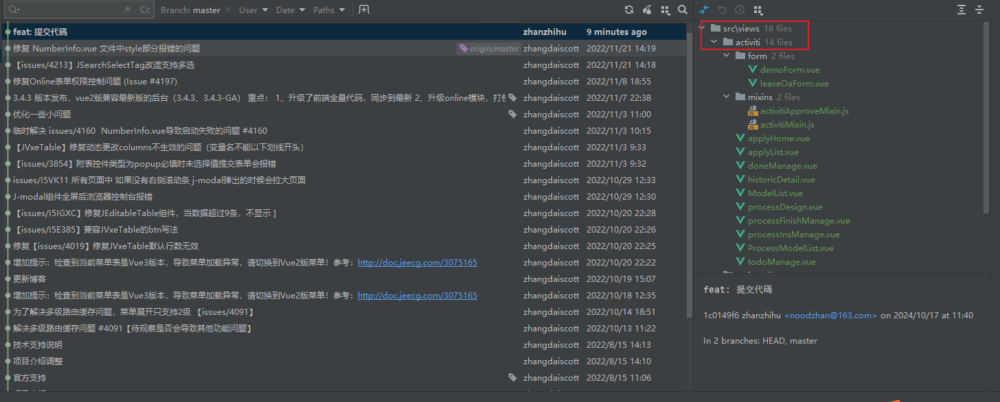

# 介绍 

  国内很多小公司都是基于低代码Jeecgboot做为基础框架来开发项目，由于成本原因，无法使用商业版本的工作流模块，但是在开源论坛中，几乎没有很方便集成的工作流模块。 比如开源作者宁波阿成<https://gitee.com/nbacheng/nbcio-boot>集成flowable，来回馈开源社区。
但对于它侵入式太强，做了很多新开发的功能，导致历史项目（其中有已经存在很多业务代码），集成起来就有点麻烦。  

  本项目是基于<https://github.com/happy-panda/jeecg-boot-activiti> 二开的，主要想要节省工作量，替换默认（丑的不够现代化）流程设计器，加上利用activiti提供的事件，来优化通知和流程流转模块。





## 版本

```xml
  <properties>
    <activiti.version>5.22.0</activiti.version>
    <jeecgboot.version>3.4.4</jeecgboot.version>
  </properties>
```


## 与jeecg-boot整合方法

### 数据库

执行db目录下脚本：

db/create/activiti.mysql.create.engine.sql
db/create/activiti.mysql.create.history.sql
db/create/activiti.mysql.create.identity.sql

db/update.sql

### 需要修改的文件




### 1、引入依赖

在jeecg-system-start的pom.xml引入依赖

```xml
<dependency>
  <groupId>com.noodb.jeecg</groupId>
  <artifactId>jeecg-boot-activiti</artifactId>
  <version>3.4.4</version>
</dependency>
```



### 2、配置启动类

在jeecg-system-start的启动类JeecgSystemApplication，添加下面配置

```text
@EnableAutoConfiguration(
exclude = {
org.springframework.boot.autoconfigure.security.servlet.SecurityAutoConfiguration.class,
org.springframework.boot.actuate.autoconfigure.security.servlet
.ManagementWebSecurityAutoConfiguration.class,
org.activiti.spring.boot.SecurityAutoConfiguration.class
})
```



### 3、添加访问权限

在这个类的方法ShiroConfig#shiroFilter()，添加下面配置
```text
        //activiti
        filterChainDefinitionMap.put("/activiti/**", "anon");
        filterChainDefinitionMap.put("/bpm/**/*", "anon");
```



## 前端整合
 将activiti目录复制到前端工程views目录下即可


## 文档

[流程表单开发](./doc/流程表单开发.md)  
[流程引擎涉及业务表单](./doc/流程引擎涉及业务表单.md)  
[整合activiti表单.md](./doc/整合activiti流程.md)  
[工作流加签转办实现](./doc/activiti-加签转办实现.md)  
[工作流并行会签实现](./doc/activiti-并行会签实现.md)  
[工作流抄送任务实现](./doc/activiti-抄送任务实现.md)  

