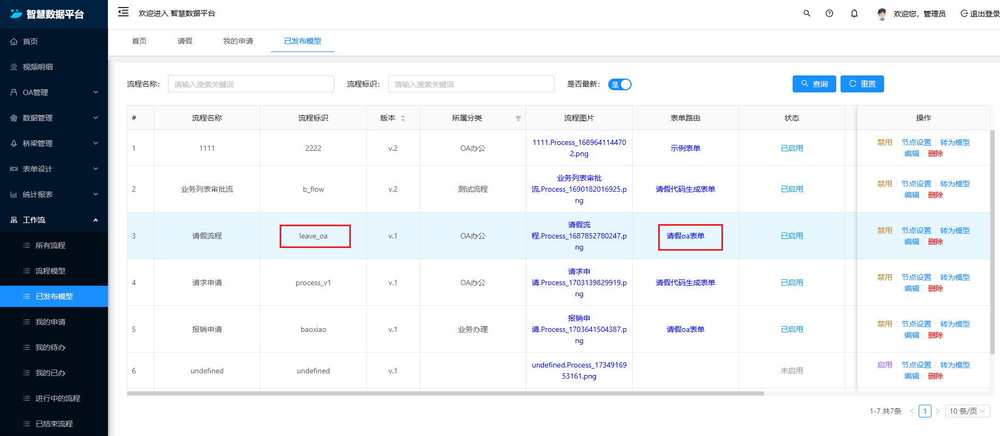
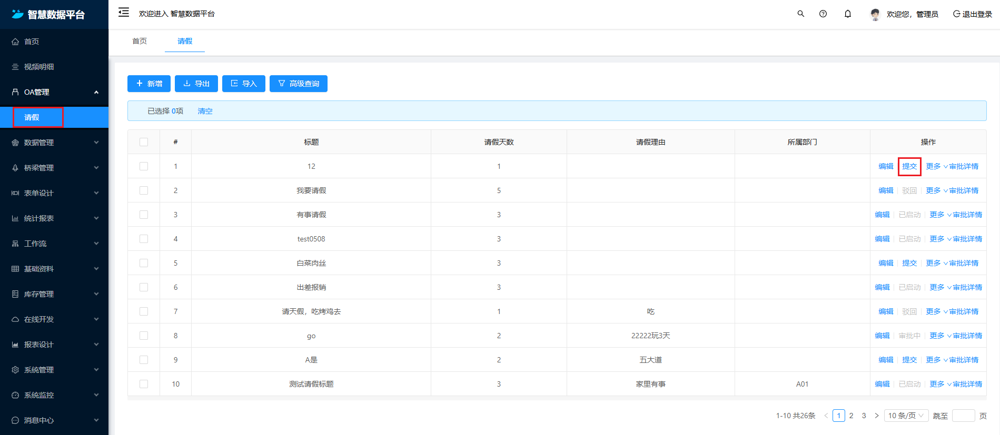
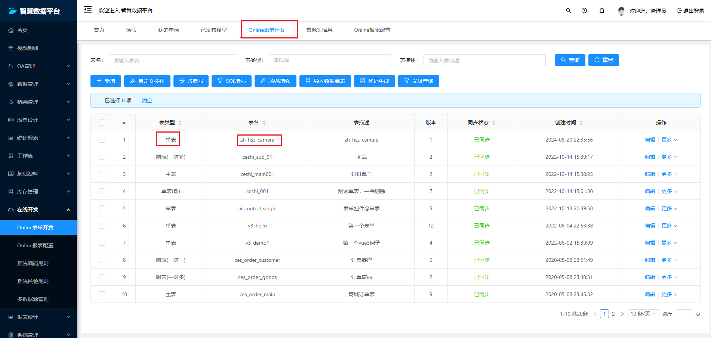

## 工作流中涉及的表单

### 业务表单

业务表单：就比如说，我有个一个采购申请单，需要审核。那么就需要配置这个业务单据和审批流进行关联。然后需要配置状态得字段，编码。【编码告诉我们是如何把流程实例和审批流进行关联起来】

业务表单：存在很多种形式；一种是我们数据库里面有该表结构的存在；【单表或主从表】；还有一种类似于online的表单。；或者是通过表单设计器实现的表单；都可以作为业务表单；本质上是要将表单的中的记录和审批流实例中绑定。

那么我们思考业务表单怎么和流程实例绑定？

一、 数据库有存在的表；比如请假申请单。t_leave

首先我们肯定需要配置；t_leave和对应发布好的流程模型进行绑定。我们可以建立关联关系【业务表数据名、表单路由、流程定义id】。

这里解释一下为什么需要表单路由。因为在查看历史节点的时候，我们需要查看表单。那么就需要表单路由。 那么在开始发起提交审批的时候，我们需要什么数据。【业务数据库表名，记录id】；这样我们可以查到对应使用那个审批流。

二、online 生成的表单；比如jeecgboot搭建的online表单。

1、建立关联【onlineId、流程定义Id、表单路由】

2、提交流程的时候，onlineId、dateId。需要online表单的唯一标识；还有该表单一条记录的标识。

三、 使用form表单引擎构建出来的

同理

### 流程节点表单

流程节点表单； 是绑定在审批流中的，每个节点绑定，自定义表单，可以在审批的过程中使用。该表单可以通过表单设计器来实现，通过在处理待办任务的时候，需要填写该表单信息。
